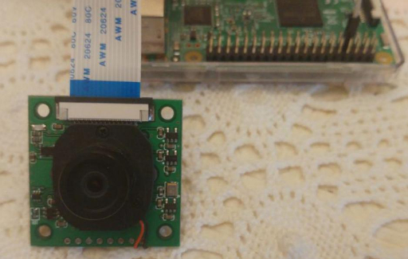

# CameraLED
Pure python3 library to control Camera LED for RaspberryPi 3

# Background
This library is used for ArduCAM with motorized IR Cut Filter.  
The IR Cur filter is connected to the camera LED, so by controlling the LED you can control the IR filter.  
This python library is used to control the camera LED (and IR filter) on Raspberry 3.  .  

# Prerequisites
You have to disable the automatic management of camera led in `/boot/config.txt`.  
```bash
$ sudo echo "disable_camera_led=1" >> /boot/config.txt 
$ sudo reboot
```
If permission denied
you can do 

```bash
$ sudo nano /boot/config.txt
```
add "disable_camera_led=1" at the file end. Then save the file and reboot .
```bash
$ sudo reboot
```
# Installation
```bash
$ wget https://raw.githubusercontent.com/arducam/RPI_Motorized_IRCut_Control/master/CameraLED.py 
$ chmod 755 CameraLED.py
```

# Usage
You need to be root (or at least be able to use sudo).
### Standalone
You can use the library as a standalone command:
```bash
$ sudo ./CameraLED.py 
Usage: ./CameraLED.py (state|toggle|on|off)

$ sudo ./CameraLED.py state
State: 0

$ sudo ./CameraLED.py toggle
State: 1

$ sudo ./CameraLED.py toggle
State: 0

$ sudo ./CameraLED.py on    
State: 1

$ sudo ./CameraLED.py off
State: 0
```
### Python library
You can use my library in your Camera projects
```python
from CameraLED import CameraLED
led = CameraLED() # CameraLED(134)
led.on()
led.off()
led.toggle()
led.state()
```

# Photos
LED OFF = NO IR filter = Night vision  
  
LED ON = IR filter = Daily vision  
  
